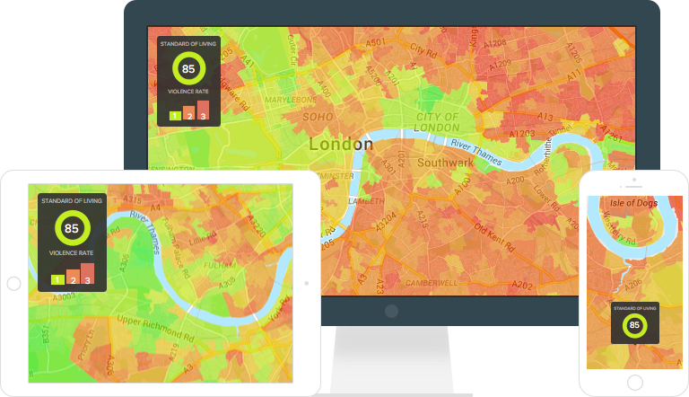
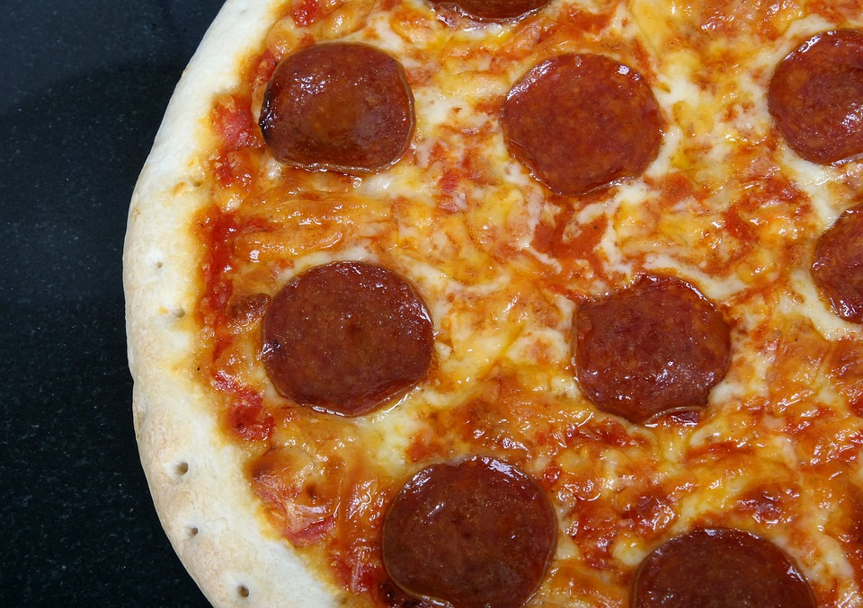

# CartoDB

**Free Pizza**
Maptime is BYOB. Tea and coffee is provided, but you're welcome to bring your own beer, drinks, snacks or dinner to the Waag. 
Form now on we will also have free pizza during our Maptimes! (As snacks not as dinner) [CartoDB is sponsoring free pizza](http://maptime.io/blog/2016/04/18/carto-pizza-update/ ) to every Maptime organised and of course we are going to make use of this! 

Maptime is, rather literally, time for mapmaking. Our mission is to open the doors of cartographic possibility to anyone interested by creating a time and space for collaborative learning, exploration, and map creation using mapping tools and technologies.
Maptime is hands-on, so don't forget to bring your laptop! All skill levels are welcome.

